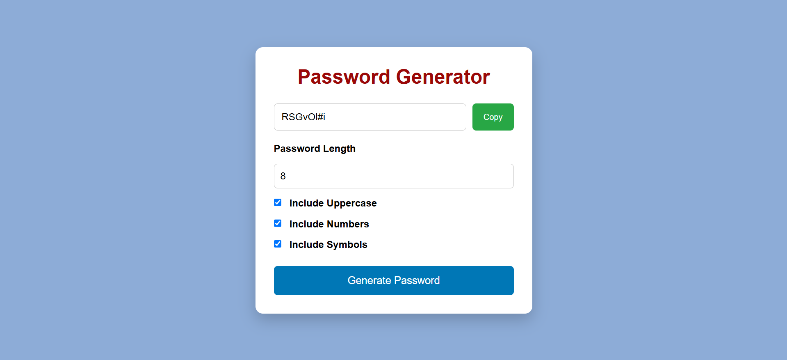

# 🔐 Password Generator Website

A simple, responsive, and user-friendly Password Generator web application built using **HTML**, **CSS**, and **JavaScript**. It allows users to generate secure random passwords based on their preferred length and character options.

## 🌐 Live Demo

**Live Website:**  https://a-navaneetha.github.io/Password-Generator-Website/

## 📸 Images 

* Password Generator Website looks like this :
  
```markdown

```

* If we enter the length of the password , then click Generate Password button and password gets generated.
   
```markdown

```

## ✨ Features

- 🔒 Generate random passwords instantly
- 📏 Choose password length (4–30 characters)
- 🔠 Include uppercase letters
- 🔢 Include numbers
- 🔣 Include special symbols
- 📋 Copy generated password to clipboard
- 📱 Fully responsive design for:
  - Mobile devices
  - Tablets
  - Laptops
  - Desktop screens
- ✅ Simple and clean user interface
- ⚡ Fast and lightweight (no external libraries)

## 🛠️ Technologies Used

- HTML5
- CSS3
- JavaScript (ES6)

## 📂 Project Structure

```
Password-Generator/
│
├── index.html
├── style.css
├── script.js
└── README.md
```

## 🚀 Getting Started

### 1. Clone the repository

```bash
git clone https://github.com/A-Navaneetha/Password-Generator-Website.git
```

### 2. Open the project

```bash
cd Password-Generator-Website
```

### 3. Run the application

Open the `index.html` file in your browser.

Or use the **Live Server** extension in Visual Studio Code.

## 💻 How to Use

1. Enter the desired password length (4–30).
2. Select the character options:
   - Uppercase letters
   - Numbers
   - Symbols
3. Click **Generate Password**.
4. Copy the generated password using the **Copy** button.

## 📱 Responsive Design

This project is optimized for:

- 📱 Mobile Phones
- 📱 Tablets
- 💻 Laptops
- 🖥️ Desktop Computers

## 📌 Future Improvements

- Password strength indicator
- Show/Hide password
- Dark mode
- Password history
- Custom color themes
- Slider for password length
- Toast notifications instead of alerts

## 👨‍💻 Developer 

**Navaneetha**

GitHub: https://github.com/A-Navaneetha/Password-Generator-Website

## 📄 License

This project is licensed under the MIT License.
